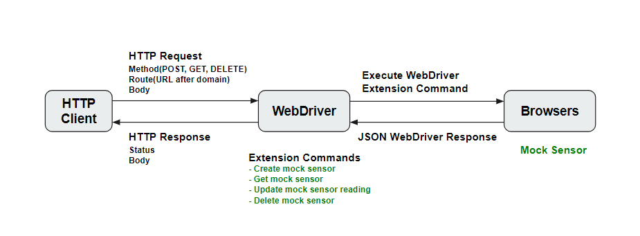

# WebDriver Extension API for Generic Sensor Explained
**Written**: 2018-09-18

## What’s all this then?

[Generic Sensor API](https://w3c.github.io/sensors/) and its concrete Sensor APIs pose a challenge to test authors because to fully exercise their interfaces requires physical hardware devices that respond in predictable ways.

At best some vendors have their own automation by using a mocking mechanism, which however introduces the challenge of duplicate efforts across different browsers as well as inconsistency of different automation, meaning that different proprietary automation may not do the exact same thing.

To address these challenges, this proposal attempts to define extension commands to the [WebDriver](https://w3c.github.io/webdriver/) specification for controlling mock sensor on the host that the user agent is running on. With these extension commands devices with particular properties can be created and their responses to requests are well defined.

### Why prefer a WebDriver Extension API?
The reasons for preferring a WebDriver API where appropriate are twofold. Principally exposing things through WebDriver allows web developers to use them to test sites, an important part of the story 
around making the web a more appealing platform. The secondary reason is that integrating with an existing spec makes it obvious what quality bar has to be met for these testing features, which helps alleviate the concern around ending up with tests that are nominally cross-vendor but actually tied to a specific implementation.

### Goals

 - Allow user agents to create mock sensor devices that have certain characteristics and behave in a specific way.
 - Easy controlling mock sensor via [WebDriver Protocol Extension Commands](https://w3c.github.io/webdriver/#protocol-extensions).

### Non-goals

 - Not intend to expose Mock Sensor API to web developer directly.

### Draft Spec

[Draft Spec](https://w3c.github.io/sensors/webdriver-extension)


## What is Mock Sensor?

A mock sensor simulates the behavior of a [platform sensor](https://w3c.github.io/sensors/#concept-platform-sensor) in controlled ways for the purpose of sufficiently meeting requirements of automation testing for Generic Sensor API. A mock sensor should have the following capabilities:
 - Reporting mock sensor readings, which is a source of mocking information about the environment, to [Sensor](https://w3c.github.io/sensors/#sensor) objects at the rate of its requested sampling frequency if the user agent is [allowed to expose sensor readings](https://w3c.github.io/sensors/#can-expose-sensor-readings). 
 - User specified mock sensor reading, user agent allows user-customized mock sensor reading for a mock sensor.
 - A sampling frequency, which is defined as a frequency at which the user agent obtains sensor readings from mock sensor. The sampling frequency has an upper and lower bounds, which is designed for the purpose of calculating expected sampling frequency. For instance, when construct a Sensor object with frequency option that exceed the maximium supported sampling frequency, the exact requested sampling frequency should capped to the maximum sampling frequency.
 - A requested sampling frequency, used for calculating expected sampling frequency.
 - A connection flag that is used for switching the connection between Sensor object and mock sensor, for testing the `NotReadableError` exception when calling [`sensor.start()`](https://w3c.github.io/sensors/#sensor-start) fails.

## Getting started

### Basic Flow

This is a basic work flow that demonstrates how WebDriver interacts with browsers and tests that run on a HTTP client.

Tests could be written in any languages, as long as it wraps the WebDriver HTTP APIs. Basically, tests send commands across the common WebDriver API with [WebDriver wire protocol](https://w3c.github.io/webdriver/#protocol), on the other side, the WebDriver, which runs an HTTP server that implements the extension APIs in the WebDriver spec, receives those commands and execute them on the actual browser to manipulate mock sensors and then returns the result all the way back.



### Create mock sensor

 To create an "accelerometer" mock sensor with session ID 21, the local end would send a `POST` request to `/session/21/sensor/` with the body:
 ```
{
    "mockSensorType": "accelerometer",
    "maxSamplingFrequency": 60,
    "minSamplingFrequency": 5,
    "connected": true
}
 ```
A mock sensor could be configured with following properties:
- `mockSensorType`: a string that indicates a [sensor type](https://w3c.github.io/sensors/#sensor-type)'s associated [Sensor](https://w3c.github.io/sensors/#sensor) subclass.
- `maxSamplingFrequency`: a double representing frequency in Hz, used for specifying a mock sensor's maximum supported sampling frequency.
- `minSamplingFrequency`: a double representing frequency in Hz, used for specifying a mock sensor's minimum supported sampling frequency.
- `connected`: a boolean that indicates a mock sensor's connection flag.

Once a mock sensor instance is presented, the user agent must force the same sensor type of activated Sensor objects to associate with this mock sensor. And only one mock sensor of a given mock sensor type can be created in current browsing context.
 
### Get mock sensor

To get an "accelerometer" mock sensor with session ID 22, the local end would send a `GET` request to `/session/22/sensor/accelerometer/` without body, if succeed, the remote end would response with the serialized mock sensor as data:
 ```
{
    "maxSamplingFrequency": 60,
    "minSamplingFrequency": 5,
    "requestedSamplingFrequency": 30
}
 ```

### Update mock sensor reading

To update the mock sensor reading of "accelerometer" mock sensor with session ID 23, the local end would send a `POST` request to `/session/23/sensor/accelerometer/` with body:
 ```
{
    "x": 1.12345,
    "y": 2.12345,
    "z": 3.12345
}
 ```

A mock sensor reading contains attributes of:
  - Attributes that defined by the [sensor type](https://w3c.github.io/sensors/#sensor-type)'s associated [extension sensor interface](https://w3c.github.io/sensors/#extension-sensor-interface), which could be updated with this command.
  - `timestamp`: For all tests mock sensor reading should have monotonically increasing timestamp, its value is a high resolution timestamp that estimates the [reading timestamp](https://w3c.github.io/sensors/#reading-timestamp) expressed in milliseconds since the time origin. User agent could easily implement it by using the [Performance API](https://www.w3.org/TR/hr-time-2/#sec-performance).

User agent must provide the mock sensor reading that are initially exposed to the Sensor objects for the convenience of testing some cases that don't need a user-specified mock sensor reading.

### Delete mock sensor

To delete an "accelerometer" mock sensor with session ID 24, the local end would send a `DELETE` request to `/session/24/sensor/accelerometer/` without body.

## References & acknowledgements

 - Discussion on public-test-infra mailing list: [UserAgent-specific files in Web Platform Tests](https://www.w3.org/Search/Mail/Public/search?keywords=&hdr-1-name=subject&hdr-1-query=%22UserAgent-specific+files+in+Web+Platform+Tests%22&index-grp=Public_FULL&index-type=g&type-index=)
 - [Generic Sesnor API](https://w3c.github.io/sensors/#sensor)
 

Many thanks to Anssi Kostiainen, Raphael Kubo da Costa, Alexander Shalamov, Tobie Langel, Philip Jägenstedt, Jonathon Kereliuk, and Mike Pennisi for their comments and contributions to the discussions that have informed it.
